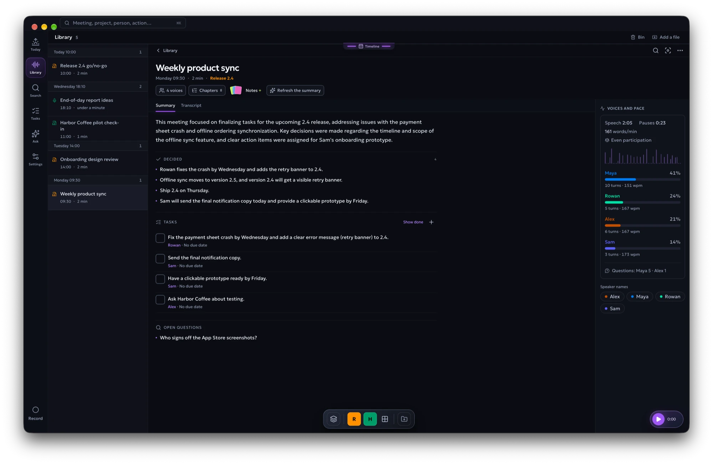
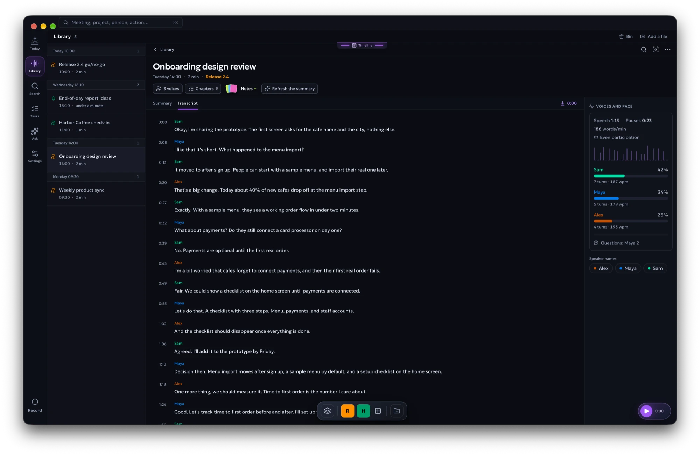
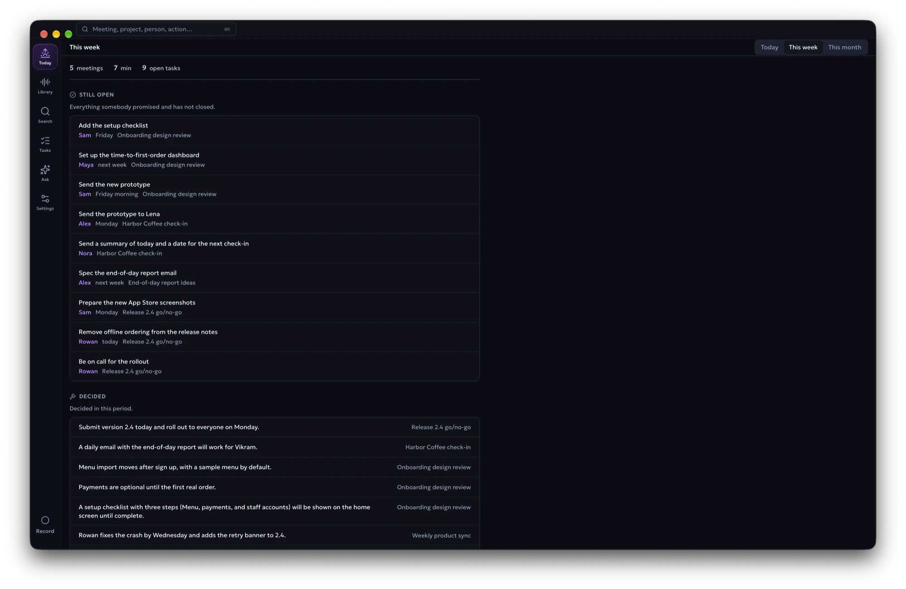
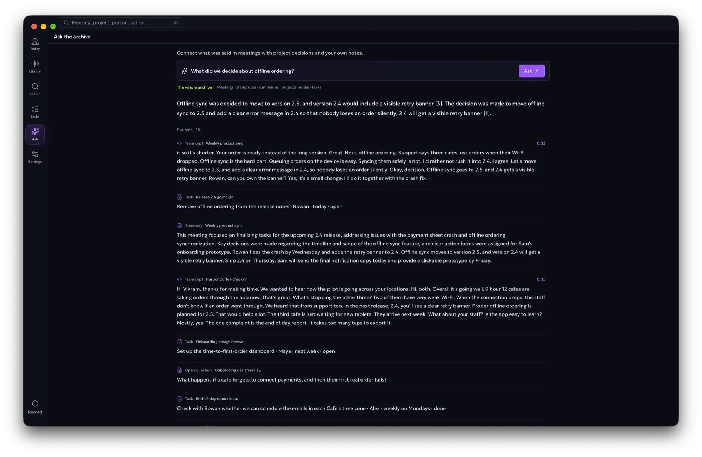
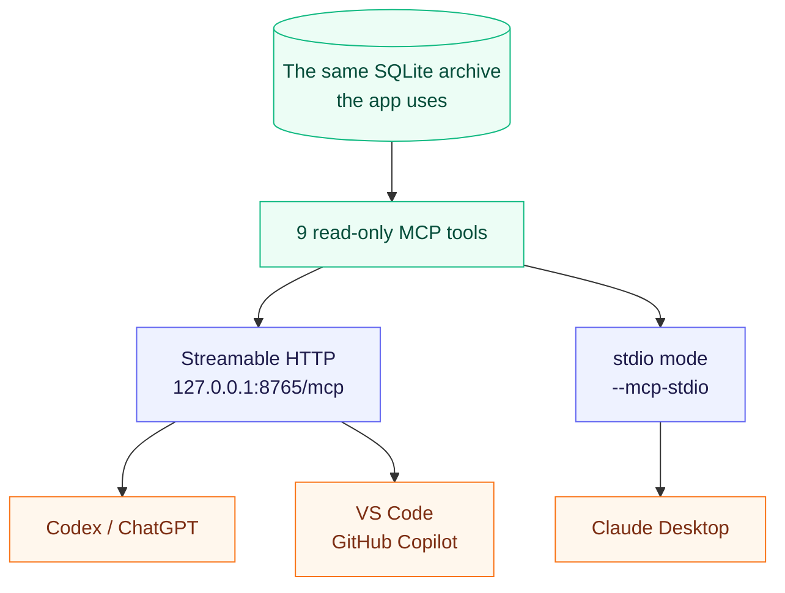
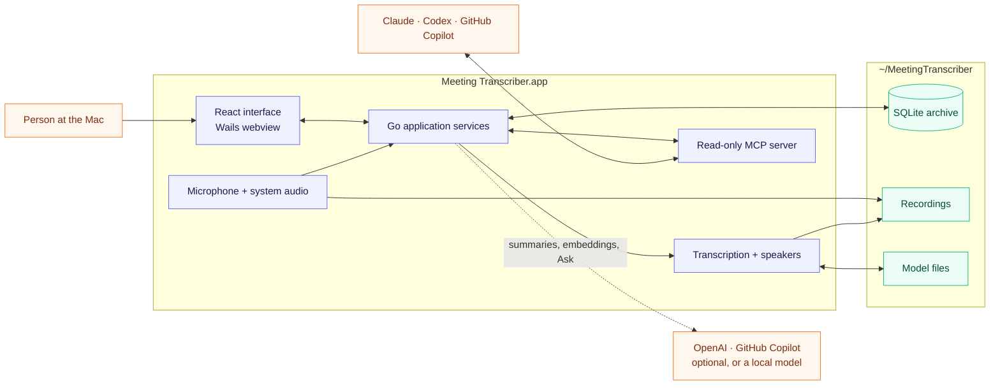

<p align="center">
  
</p>

<h1 align="center">Meeting Transcriber</h1>

<p align="center">
  A private meeting archive for macOS. It records your calls, writes down who
  said what, and keeps the decisions and the follow-up work. Transcription runs
  on your Mac: no bot joins the call, and no account is needed.
</p>

<p align="center">
  <a href="https://github.com/dmykolen/meeting-transcriber-go/releases/latest"><strong>Download for macOS</strong></a>
  · Apple Silicon · macOS 14.2 or newer · MIT
</p>

<p align="center">
  
</p>

You leave a call knowing something was decided, but not where it was said or
who agreed to do it. Meeting Transcriber records the microphone and the other
side of the call, turns the audio into a transcript with speaker names, and
keeps it on the Mac with the decisions, questions and tasks that came out of
it. Over weeks it becomes an archive you can search, ask and hand to your own
AI tools.

## What it does

### Records the call, with a strip that stays out of the way

The app notices when a conversation starts and records it, or you press
**Record**. The microphone and the system audio go to separate channels, so
your voice is never confused with the people on the call. While it records, a
strip under the menu bar asks you to tell the others, then shows the latest
line it heard, with **Pause** and **Stop** at hand. The strip stays over
full-screen apps and is left out of screen sharing.

<p align="center">
  
</p>

### Writes the transcript and learns the voices

Whisper turns the recording into a transcript; speaker separation splits the
other side of the call into voices. Name a voice once and later meetings use
the name when the voice matches. Click any line to hear it.

<p align="center">
  
</p>

### Keeps what was decided and who does what

With AI switched on, each meeting gets an overview, chapters, decisions, open
questions and tasks with owners and deadlines. **Today** collects what happened recently and what is
still open; **Tasks** lists every promise across meetings.

<p align="center">
  
</p>

### Follows a project across meetings

File meetings into a project and it keeps a living document: where things
stand, the work list, decisions, questions and people, each linked to the
meeting it came from. An item you edit is pinned: the model can mark it done
but never rewrites it.

### Answers questions from your archive

Search by words, or by meaning when AI search is on. **Ask** answers from your
meetings, notes and projects and links every answer back to the passages it
used.

<p align="center">
  
</p>

### Lets your AI tools read it

A read-only MCP server is built in. Claude Desktop, Codex, ChatGPT and VS Code
with GitHub Copilot can search transcripts, open meetings, list tasks and read
project state. See [MCP access](#mcp-access).

### Everything else

| Area | What you get |
|---|---|
| Recording | Automatic or manual, microphone and system audio on separate channels, live transcript, pause and stop from the strip |
| Import | Audio and video files from the native file picker |
| Transcript | Timestamps, speaker names, click to play, waveform, notes, retranscription |
| People | Learned voice names; the person at the Mac is identified once in Settings |
| Summary | Overview, chapters, topics, decisions, open questions, tasks with owners and deadlines |
| Today and Tasks | A recent briefing, open and overdue work, recurring questions |
| Projects | A living status per project, with links back to each meeting |
| Search and Ask | Local keyword search, search by meaning, answers with sources |
| Schedule | Transcribe right after a recording, at a set time, or when nobody is using the Mac; **Transcribe now** puts one meeting first |
| Retention | Audio expires after a set number of days; transcripts, summaries and notes stay |
| MCP | Read-only access to meetings, transcripts, notes, projects, tasks, briefings and people |
| Interface | English or Ukrainian, switched in Settings |

## Private by design

| Runs on your Mac | Optional, and only if you choose it |
|---|---|
| Recording, transcription and speaker separation | Summaries, Ask and project updates from OpenAI or GitHub Copilot |
| Voice names, playback, analytics | Search by meaning with OpenAI embeddings |
| Keyword search and the whole archive | |
| Summaries, Ask and search by meaning with a local model | |

AI is optional. Without it, recording, transcripts, speaker names and keyword
search all work. With the local option, summaries and answers come from a model
that runs on the Mac, so nothing leaves it.

The MCP server only listens on `127.0.0.1` and never returns API keys or raw
voiceprints. The app asks GitHub once an hour whether a newer version exists
(Settings → Storage turns that off) and offers to install it; nothing else
leaves the Mac without your choice.

## Install

1. Download the `.dmg` from the
   [latest release](https://github.com/dmykolen/meeting-transcriber-go/releases/latest).
2. Open it and drag **Meeting Transcriber** to **Applications**.
3. Open the app. It is not notarized by Apple, so the first time macOS refuses
   to open it. Go to **System Settings → Privacy & Security**, find the message
   about Meeting Transcriber and choose **Open Anyway**. You do this once.
4. Allow **Microphone** and **System Audio Recording** when macOS asks.

On the first launch the app downloads about 600 MiB into `~/MeetingTranscriber`:
the transcription, speech-detection and speaker models, and FFmpeg.
The window opens straight away and shows the download; after that, recording
and transcription work offline.

Transcription uses Whisper large-v3-turbo, so it handles the languages Whisper
does. Set the language in Settings or let it be detected for each meeting.
English and Ukrainian are the most tested.

## AI options

Choose in **Settings → AI and archive**. Recording and transcription do not
depend on it.

- **OpenAI** — paste an API key.
- **GitHub Copilot** — the app fetches the Copilot CLI (about 90 MB), you sign
  in with GitHub in the browser and pick one of your plan's models. Requests
  use your plan's AI Credits; Business and Enterprise plans need the Copilot
  CLI policy enabled.
- **Local** — the app fetches Gemma 4 E2B (2.8 GB) and runs it with the bundled
  `llama-server`. Paste a Hugging Face `.gguf` link to use a bigger model.
  Search by meaning can run locally too, with Qwen3 Embedding 0.6B (0.6 GB).

## Where your data lives

```text
~/MeetingTranscriber/
├── config.toml       settings, the AI choice, and an optional OpenAI key
├── meetings.db       transcripts, summaries, projects, notes, and search data
├── recordings/       captured and imported audio
├── models/           downloaded models, local AI models included
├── bin/              FFmpeg, and the Copilot CLI when chosen
├── copilot/          the Copilot CLI's own state
├── cache/            playback files
└── logs/mt.log       the application log
```

`MT_HOME` moves the whole folder. Audio is kept for 30 days by default; deleting
audio never deletes the transcript or anything made from it.

## MCP access

The MCP server is part of the app, not a second program. It opens as soon as
the database is ready, without waiting for the speech models.



The tools list and open recordings, search transcripts and stored knowledge,
read projects, list action items, build a recent briefing and list recognised
people. Codex, ChatGPT and VS Code connect to the HTTP endpoint while the app is
open; Claude Desktop starts the same executable in stdio mode.

**Settings → MCP Server** shows the live status and ready-to-copy configuration
for each client. The same examples are in [docs/mcp.md](docs/mcp.md).

## How it works

One process owns everything: the React interface is embedded in the Go
executable by Wails, and the same process records, runs the queue, keeps the
SQLite database and serves MCP.



A live call and an imported file enter the same queue. A recording in progress
always comes first, so old imports never make the current meeting lag.

```mermaid
flowchart LR
    Start{"Live call or<br/>imported file?"}
    Capture["Capture or copy audio"]
    Queue["Add to SQLite queue"]
    Decode["Decode and align channels"]
    ASR["Transcribe locally"]
    Speakers["Separate speakers"]
    Names["Apply learned names"]
    Save["Save transcript + voice evidence"]
    Index["Build searchable passages"]
    Summary{"AI chosen?"}
    AI["Summarise and<br/>update the project"]
    Ready["Ready in Library,<br/>Today, Search, and MCP"]

    Start --> Capture --> Queue --> Decode --> ASR --> Speakers --> Names --> Save --> Index --> Summary
    Summary -->|"yes"| AI --> Ready
    Summary -->|"no"| Ready

    classDef local fill:#ECFDF5,stroke:#10B981,color:#064E3B
    classDef decision fill:#FFF7ED,stroke:#F97316,color:#7C2D12
    classDef result fill:#EEF2FF,stroke:#6366F1,color:#1E1B4B
    class Capture,Queue,Decode,ASR,Speakers,Names,Save,Index local
    class Start,Summary decision
    class AI,Ready result
```



The microphone channel is the person at the Mac; the system channel is everyone
else. Speaker separation runs on the system channel, so your own voice echoing
in the room does not become a second speaker. The `.app` carries the speaker
libraries, an `audiotee` helper for system audio and `llama-server` for local
models; the models themselves are downloaded per user.

The reasoning behind these choices, with the measurements, is in
[engineering decisions](.spec/decisions.md) and
[architecture](.spec/architecture.md).

## Build from source

You need an Apple Silicon Mac with macOS 14.2 or newer, Go 1.26.2, Node.js
with npm, CMake and the Xcode Command Line Tools. The first build fetches the
pinned native sources and frontend dependencies.

```bash
make           # build/mt, the development binary
make bundle    # build/Meeting Transcriber.app
make run       # open the bundle, so macOS gives the permissions to the app
make install   # replace /Applications/Meeting Transcriber.app with this build
make dmg       # build/MeetingTranscriber.dmg
make test      # go vet and go test
```

Always run the `.app`. Started as a bare `build/mt` from a terminal, the
microphone permission belongs to the terminal and the app records silence.
`make cert` creates a local signing identity once, so macOS keeps the
permissions across rebuilds.

To work on the interface with sample data and without the models:

```bash
cd frontend
VITE_DESIGN=1 npm run dev
```

## Contributing

Issues and pull requests are welcome. [AGENTS.md](AGENTS.md) is the working
agreement for this repository: how the code is organised, what must not break,
and how changes are tested. Audio, model and threshold changes are decided by
measurements in `exp/`, described in [experiments](.spec/experiments.md); the
[roadmap](.spec/roadmap.md) lists what comes next.

## License

MIT. See [LICENSE](LICENSE).

## Acknowledgements

Meeting Transcriber stands on these projects:
[whisper.cpp](https://github.com/ggml-org/whisper.cpp) and
[llama.cpp](https://github.com/ggml-org/llama.cpp) (MIT),
[sherpa-onnx](https://github.com/k2-fsa/sherpa-onnx) (Apache-2.0),
[audiotee](https://github.com/makeusabrew/audiotee) (MIT),
[Wails](https://github.com/wailsapp/wails) (MIT),
[React](https://react.dev), [Motion](https://motion.dev),
[Lucide](https://lucide.dev) and [Tailwind CSS](https://tailwindcss.com), and
the [Geologica](https://fonts.google.com/specimen/Geologica) typeface (SIL Open
Font License, [notice](frontend/public/fonts/OFL.txt)).

The models it downloads keep their own licences: Whisper large-v3-turbo (MIT),
Silero VAD (MIT), pyannote segmentation 3.0 (MIT), 3D-Speaker CAM++
(Apache-2.0), Parakeet TDT 0.6B v3 (CC BY 4.0), Gemma 4 E2B (Apache-2.0) and
Qwen3 Embedding 0.6B (Apache-2.0). FFmpeg is downloaded as a separate program
under its own licence.
