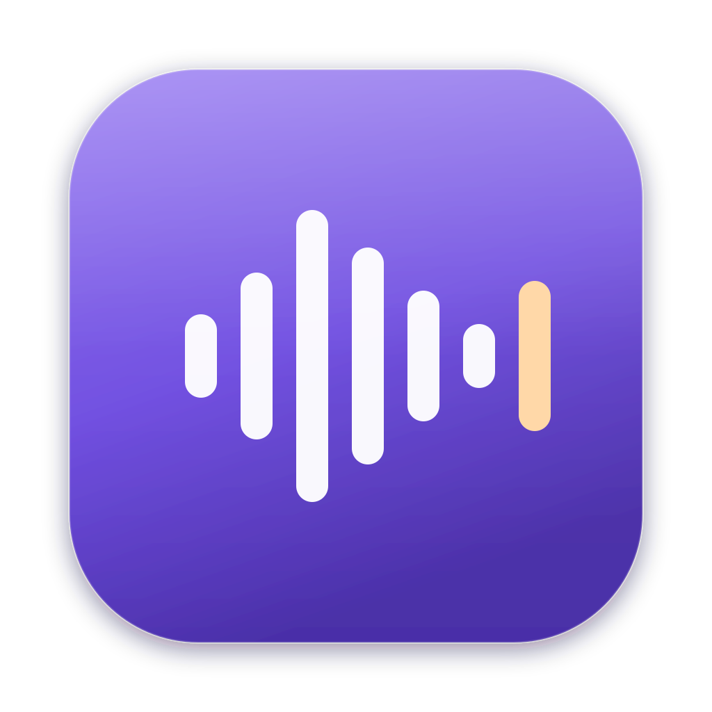
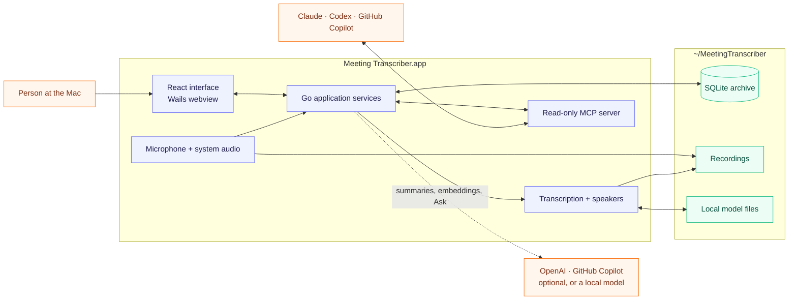
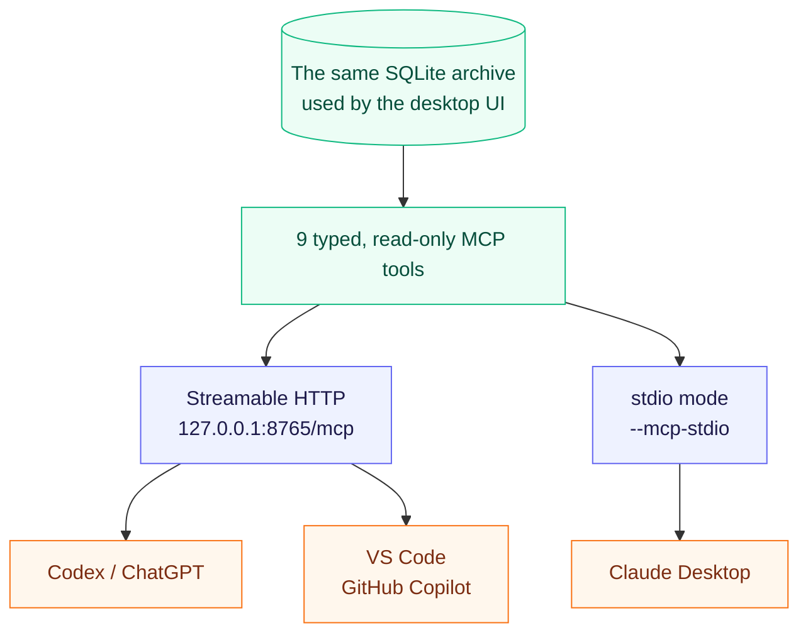
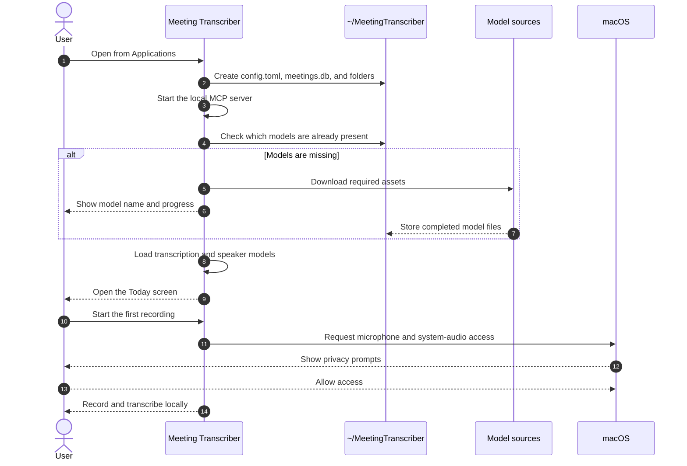
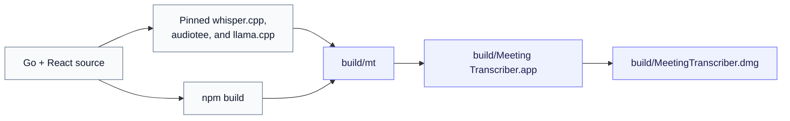

<p align="center">
  
</p>

<h1 align="center">Meeting Transcriber</h1>

<p align="center">
  A private macOS meeting archive that records calls, separates speakers,
  writes searchable transcripts, and keeps decisions and follow-up work in one place.
</p>

<p align="center">
  <strong>Interactive demo:</strong>
  download <a href="docs/demo.html"><code>docs/demo.html</code></a> and open it locally.
</p>

Meeting Transcriber is for people who leave a call knowing that something
important was decided, but not where it was said or who agreed to do it. It
records the microphone and the other side of the call, turns the audio into a
speaker-labelled transcript, and keeps the result on the Mac.

The app is useful before, during, and after a meeting:

- it can start recording automatically when a conversation begins;
- the live transcript appears while the meeting is still running;
- saved meetings remain searchable by words or meaning;
- decisions, questions, deadlines, and action items are collected across calls;
- projects show how work changed from one meeting to the next;
- Claude, Codex, and GitHub Copilot can read the archive through the built-in
  read-only MCP server.

Transcription, speaker detection, playback, analytics, and keyword search run
locally. Summaries, Ask, AI-maintained project state, and search by meaning are
optional, and each can come from OpenAI, from your GitHub Copilot, or from a
model that runs on the Mac, so that nothing leaves it.

> [!NOTE]
> The current package is built for Apple Silicon Macs and requires macOS 14.2
> or newer. System-audio capture depends on Core Audio process taps introduced
> in macOS 14.2.

## How the app is put together

The interface and backend ship as one desktop application. The React interface
is embedded in the Go executable by Wails; the same process owns the recording
queue, SQLite database, local models, and HTTP MCP server.



The `.app` also carries the native libraries used for speaker processing and a
small `audiotee` helper for macOS system audio. Models are deliberately not
inside the application: they are downloaded once on the first launch and kept
in the user's data folder.

## What it can do

| Area | What the user gets |
|---|---|
| Recording | Manual recording, automatic listening, microphone and system audio on separate channels, a live transcript, and a strip over every window that reminds you to tell the others and pauses or stops the recording |
| Import | Existing audio or video files accepted through the native file picker and decoded with app-managed tools |
| Transcript | Timestamped turns, speaker labels, click-to-play rows, waveform scrubbing, renaming, notes, and retranscription |
| People | Learned speaker names and reusable voice samples; the laptop owner can be identified once with **This is me** |
| Summary | Overview, topics, decisions, questions, owners, deadlines, and action items |
| Today | A recent briefing: what happened, what was decided, overdue work, recurring questions, and participants |
| Search | Local full-text search; search by meaning with OpenAI or a local embedding model |
| Projects | Meetings grouped into projects with a living status, work list, decisions, questions, people, and history |
| Ask | Answers grounded in saved meetings, with links back to the source passages |
| Retention | Audio expires after the configured period; transcripts, summaries, notes, and analytics remain |
| MCP Server | Read-only access to meetings, transcripts, notes, projects, tasks, briefings, and recognised people |
| AI | OpenAI with your key, the models of your GitHub Copilot plan, or local models through the bundled `llama-server`; chosen in Settings and applied at once |

### What happens to a recording

Whether audio comes from a live call or an imported file, it enters the same
queue. A live recording has priority, so an old import cannot make the current
meeting lag. Settings decide when the queue runs: right after each recording, at
a chosen time of day, or once nobody has used the Mac for five minutes and
nothing else keeps it busy. **Розшифрувати зараз** in a meeting puts it first.

```mermaid
flowchart LR
    Start{"Live call or<br/>imported file?"}
    Capture["Capture or copy audio"]
    Queue["Add to SQLite queue"]
    Decode["Decode and fold channels"]
    ASR["Transcribe locally"]
    Speakers["Separate speakers"]
    Names["Apply learned names"]
    Save["Save transcript + voice evidence"]
    Index["Build searchable passages"]
    Summary{"AI chosen and<br/>summary policy?"}
    AI["Create summary and<br/>update project state"]
    Ready["Ready in Library,<br/>Today, Search, and MCP"]

    Start --> Capture --> Queue --> Decode --> ASR --> Speakers --> Names --> Save --> Index --> Summary
    Summary -->|"yes"| AI --> Ready
    Summary -->|"no"| Ready

    classDef local fill:#ECFDF5,stroke:#10B981,color:#064E3B
    classDef decision fill:#FFF7ED,stroke:#F97316,color:#7C2D12
    classDef result fill:#EEF2FF,stroke:#6366F1,color:#1E1B4B
    class Capture,Queue,Decode,ASR,Speakers,Names,Save,Index local
    class Start,Summary decision
    class AI,Ready result
```



The microphone channel identifies the person using the Mac; the system channel
contains the remote participants. The app skips speaker separation for a
mic-only recording and reuses previously learned names only when there is
enough voice evidence to do so safely.

## MCP access

The MCP server is part of the main application, not a second program. It opens
after the configuration and SQLite database are ready, without waiting for the
speech models.



The tools can list and open recordings, search transcripts and stored
knowledge, inspect projects, list action items, build a recent briefing, and
list recognised people. They do not expose the OpenAI key or raw voiceprint
vectors, and the HTTP endpoint only accepts loopback addresses.

Open **Settings → MCP Server** in the app for live status and ready-to-copy
configuration for Claude Desktop, Codex, and VS Code. The complete examples are
also in [docs/mcp.md](docs/mcp.md).

Codex and VS Code connect to the HTTP endpoint while the desktop app is open.
Claude Desktop starts the same executable in headless stdio mode, so there is
still only one application to install.

## First launch

The person installing the app does not need Go, Python, Docker, Homebrew,
FFmpeg, or a model manager.



On the first launch, the app:

1. creates `~/MeetingTranscriber`;
2. writes a default `config.toml` and creates `meetings.db`;
3. downloads roughly 600 MiB of required transcription, voice, VAD, and media
   assets;
4. loads the models and opens the normal interface.

The download happens once. If it fails, reopening the app keeps completed
assets and retries what is still missing. After setup, local transcription can
work without an internet connection.

macOS asks for **Microphone** and **System Audio Recording** permission when
audio capture is first opened. These are the only required user actions. AI can
be chosen later in Settings, but recording and transcription do not depend on
it:

- **OpenAI** — paste an API key.
- **GitHub Copilot** — the app fetches the Copilot CLI (about 90 MB), you
  approve access in the browser, and pick one of your plan's models. Requests
  spend the plan's AI Credits; Business and Enterprise need the Copilot CLI
  policy enabled.
- **Local** — the app fetches Gemma 4 E2B (2.8 GB) and runs it with the bundled
  `llama-server`; paste a Hugging Face `.gguf` link to use a bigger model.
  Search by meaning can run locally too, with Qwen3 Embedding (0.6 GB).

The app keeps its files here:

```text
~/MeetingTranscriber/
├── config.toml       settings, the AI choice, and an optional OpenAI key
├── meetings.db       transcripts, summaries, projects, notes, and search data
├── recordings/       captured and imported media
├── models/           downloaded model files, local AI models included
├── bin/              app-managed tools: FFmpeg, and the Copilot CLI when chosen
├── copilot/          the Copilot CLI's own state
├── cache/            generated playback files
└── logs/mt.log       application log
```

`MT_HOME` can point the whole data directory somewhere else. By default, audio
is kept for 30 days; changing that setting does not delete the transcript or
other meeting data.

## Build and package

### Requirements

- an Apple Silicon Mac running macOS 14.2 or newer;
- Go `1.26.2`, matching `go.mod`;
- Node.js and npm for the embedded React interface;
- CMake and Xcode Command Line Tools;
- an internet connection for the first build, because pinned native sources
  and frontend dependencies are fetched.

From this directory:

```bash
# Development binary: build/mt
make

# Installable macOS bundle: build/Meeting Transcriber.app
make bundle

# Disk image to share: build/MeetingTranscriber.dmg
make dmg

# Open the bundle correctly so macOS attributes permissions to the app
make run

# Replace /Applications/Meeting Transcriber.app with this build
make install
```

The build stages are:



`build/mt` contains the Go backend, embedded frontend, and both MCP transports.
The distributable `.app` wraps that executable together with `audiotee`,
`llama-server`, the speaker-processing dynamic libraries, the icon, and macOS
metadata. The model
files remain outside the bundle and are downloaded per user.

In other words: there is one main executable and no separate MCP binary, but
the complete `.app` is the unit that must be installed and launched. Running
the bare `build/mt` from Terminal gives macOS privacy permissions to the
terminal instead of Meeting Transcriber.

## Share the app, not the source

The file to send to a colleague is:

```text
build/MeetingTranscriber.dmg
```

They open the disk image, drag **Meeting Transcriber** to **Applications**, and
launch it from there. The DMG contains the UI, Go backend, MCP server, system
audio helper, local AI helper, and native libraries. They do not need the
repository or a development environment.

There are two different signing cases:

### Local or trusted testing

`make dmg` signs the bundle ad hoc unless it finds the local certificate created
by `make cert`. That local certificate keeps microphone permissions stable
between builds on the developer's own Mac; it is not a public distribution
identity.

A DMG made this way can be sent to a trusted colleague, but Gatekeeper may block
the first launch because the app is not notarized. The colleague must explicitly
approve it in **System Settings → Privacy & Security**. This is workable for a
small internal test, not a good release experience.

### Normal colleague distribution

For a DMG that opens without security workarounds:

1. join the Apple Developer Program and obtain a **Developer ID Application**
   certificate;
2. sign the app and every nested executable with that identity and the hardened
   runtime enabled;
3. submit the app or DMG to Apple's notarization service with `notarytool`;
4. staple the accepted notarization ticket;
5. verify the final DMG on a clean Mac before sharing it.

The current Makefile builds and signs the local package, but it does not yet
implement this Developer ID and notarization release pipeline. Apple's current
references are [Signing Mac Software with Developer ID](https://developer.apple.com/developer-id/)
and [Notarizing macOS software before distribution](https://developer.apple.com/documentation/security/notarizing-macos-software-before-distribution).

> [!IMPORTANT]
> Do not send only `build/mt`. The `.app` is what carries the native libraries,
> system-audio helper, app identity, icon, and privacy descriptions. The DMG is
> the intended hand-off.

## Development references

- [Architecture](.spec/architecture.md)
- [Engineering decisions](.spec/decisions.md)
- [Experiments](.spec/experiments.md)
- [Roadmap](.spec/roadmap.md)
- [MCP setup](docs/mcp.md)
